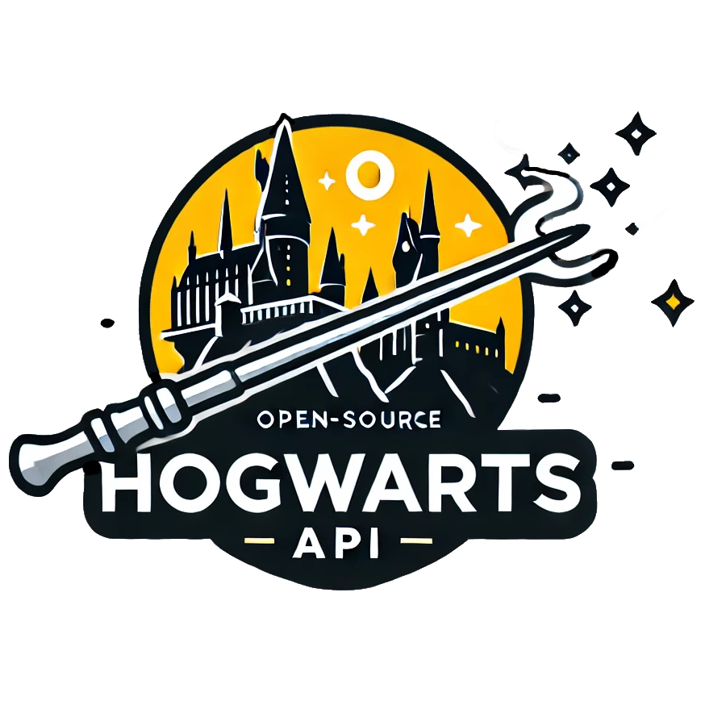

<div align="center">
  <h1 align="center">
    <a href="https://hogwarts-api.com">
      
    </a>
  </h1>

  <br />
  <a href="https://github.com/ivopauly/hogwarts-api/issues/new?assignees=&labels=bug&template=1_bug_report.yml">Report a Bug</a>
  ·
  <a href="https://github.com/ivopauly/hogwarts-api/issues/new?assignees=&labels=enhancement&template=2_feature_request.yml">Request a Feature</a>
  ·
  <a href="https://github.com/ivopauly/hogwarts-api/discussions">Ask a Question</a>
  ·
  <a href="https://github.com/ivopauly/hogwarts-api/issues?q=is%3Aopen">Issues</a>
</div>

<div align="center">
<br />

[](https://app.netlify.com/sites/hogwarts-api/deploys)
[](LICENSE)
[](https://github.com/ivopauly/hogwarts-api/stargazers)
[](https://github.com/ivopauly/hogwarts-api/graphs/contributors)
[](https://github.com/ivopauly/hogwarts-api/issues)
[](https://github.com/ivopauly/hogwarts-api/pulls)
[](https://github.com/ivopauly/hogwarts-api)

</div>

# Hogwarts API

<details open="open">
<summary>Table of Contents</summary>

- [About ✨](#about-)
- [Developer Instructions 🪄](#developer-instructions-)
- [Support 🙋](#support-)
- [Contributing 💪](#contributing-)
- [Authors & Contributors 👥](#authors--contributors-)
- [Warranty 🔒](#warranty-)
- [License 📜](#license-)

</details>

## About ✨

The Hogwarts API is a magical API containing data from the wizarding world of Harry Potter, Hogwarts Legacy and the Fantastic Beasts universe. It includes information on characters, movies, soundtracks, books, quotes, spells, and potions, making it a valuable resource for developers who need some magical (test) data to use in their code projects.

## Developer Instructions 🪄

### Setup

Make sure to install the dependencies:

```bash
# yarn
yarn install

# npm
npm install

# pnpm
pnpm install

# bun
bun install
```

### Development Server

Start the development server on http://localhost:3000

```bash
npm run dev
```

### Production

Build the application for production:

```bash
npm run build
```

Locally preview production build:

```bash
npm run preview
```

Checkout the [deployment documentation](https://nuxt.com/docs/getting-started/deployment) for more information.

## Support 🙋

If you need any support, we're here to help! You can ask your question on the [GitHub Discussions](https://github.com/ivopauly/hogwarts-api/discussions) to get help from the community or open a [GitHub issue](https://github.com/ivopauly/hogwarts-api/issues/new/choose) to report a bug or request a feature. Our team will respond to your issue as soon as possible. We're committed to providing the best support possible to our users.

If you want to say **thank you** or/and support active development of Hogwarts API:

- Add a [GitHub Star](https://github.com/ivopauly/hogwarts-api) to the project.
- Engage with the community on [GitHub Discussions](https://github.com/ivopauly/hogwarts-api/discussions).
- Write interesting articles about the project on [Dev.to](https://dev.to/), [Medium](https://medium.com/) or your personal blog.

## Contributing 💪

First off, thanks for taking the time to contribute! Contributions are what make the open-source community such an amazing place to learn, inspire, and create. Any contributions you make will benefit everybody else and are **greatly appreciated**.

If you want to help with the project make sure to look at the [Issues](https://github.com/ivopauly/hogwarts-api) and leave a note if you want to work on something.

Please note that this project is released with a [Contributor Code of Conduct](CODE_OF_CONDUCT.md). By participating in this project you agree to abide by its terms.

Please read [our contribution guidelines](CONTRIBUTING.md), and thank you for being involved!

## Authors & Contributors 👥

The original setup of this repository is by [Ivo Pauly-Koelewijn](https://github.com/ivopauly) and starter template [shadcn-docs-nuxt](https://github.com/ZTL-UwU/shadcn-docs-nuxt) is used.

For a full list of all authors and contributors, see [the contributors page](https://github.com/ivopauly/hogwarts-api/contributors).

## Warranty 🔒

Hogwarts API is provided **"as is"** without any **warranty**. Use at your own risk.

## License 📜

This project is licensed under the **MIT license**.

See [LICENSE](LICENSE) for more information.
